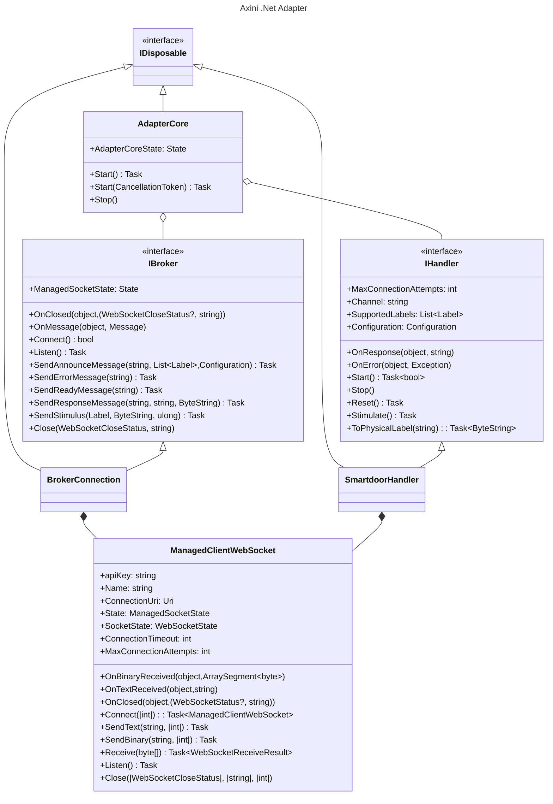

# Axini .Net Adapter Class Diagram

The following is describing the implementation of the Axini .Net Adapter.

The AdapterCore orchestrates overall state of the program and the message interchange between an IBroker and IHandler.

The IBroker and its implementation, the BrokerConnection, represent the state and connection to the Axini Modelling Platform (AMP).

The IHandler and its implementation, the SmartDoorHandler, represent the state and connection to the System Under Test (SUT). In this
example a fictional Smart Door system.

The ManagedClientWebSocket is fit-for-purpose wrapper around a [System.Net.WebSockets.ClientWebSocket](https://learn.microsoft.com/en-us/dotnet/api/system.net.websockets.clientwebsocket?view=net-8.0).
It simplifies the interface via an event-driven approach, handles the state management, handles exception handling and offers properties required to work with the AMP and Sut.

For more information about the sequence of interactions see the [associated sequence diagram](./dotnet-adapter-sequence.md).
For more information on the overall Adapter design, see the [Axini documentation](https://course02.axini.com/docs/tech/adapters/index.html).
For information on how to build and run the system see the [readme](../../readme.md).

