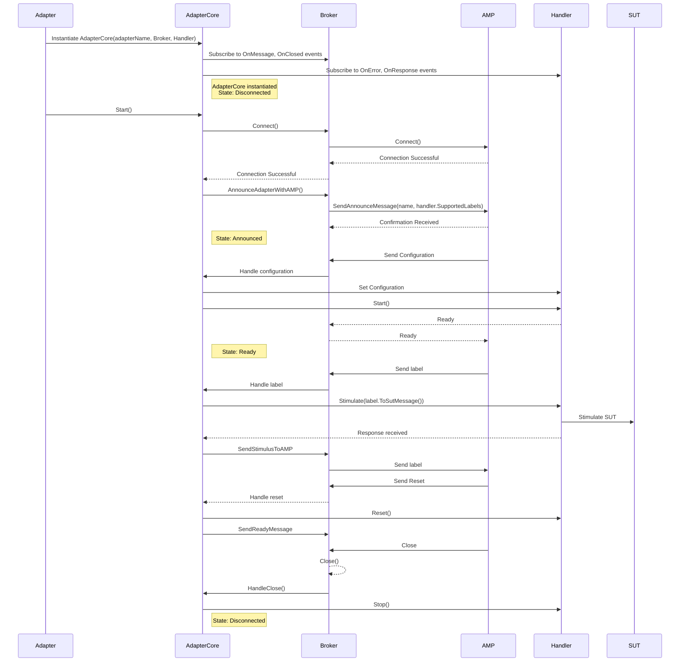

# Axini .Net Adapter Sequence Diagram

For more information about the classes involved see the [associated classdiagram](./class-diagram.md).
For more information on the overall Adapter design, see the [Axini documentation](https://course02.axini.com/docs/tech/adapters/index.html).
For information on how to build and run the system see the [readme](../../readme.md).

Note: this is based on an autogenerated (Mermaid) sequence diagram. It was somewhat correct but also wrong.
Some manual fixes have been applied.